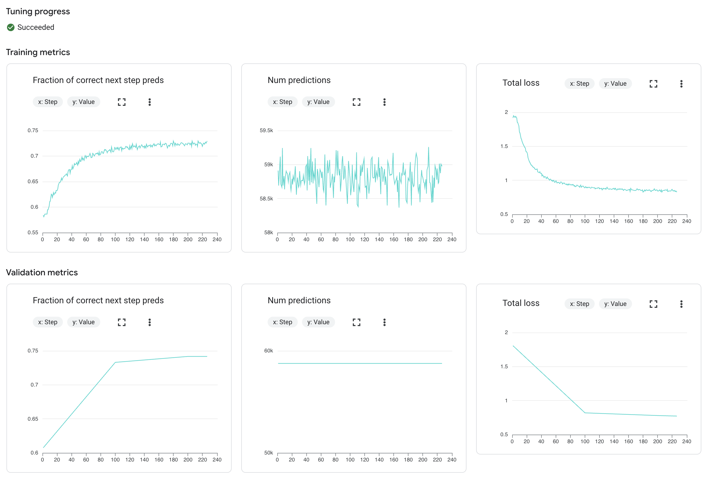
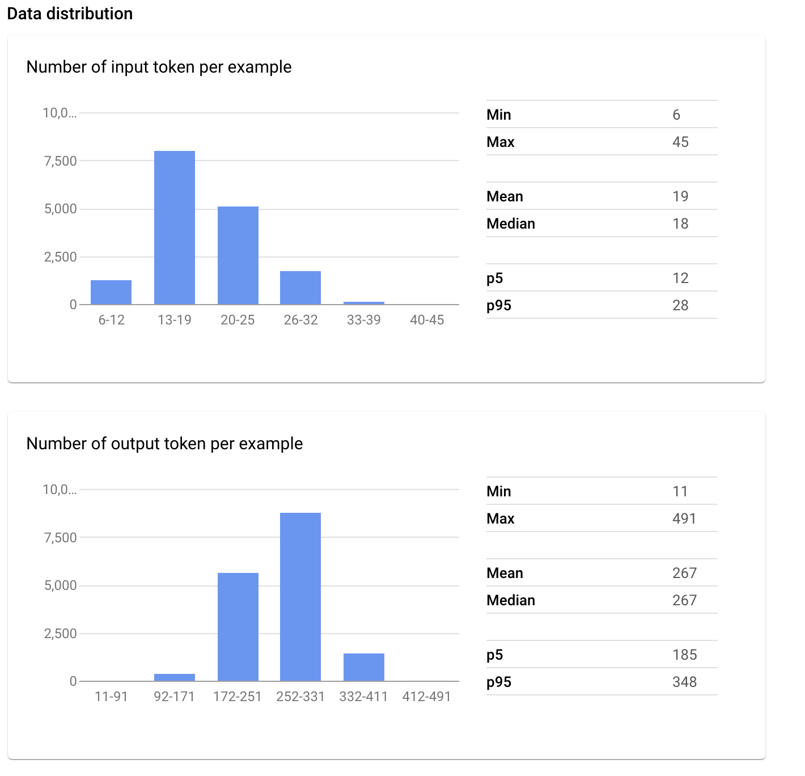

# LLM Fine-tuning

In this tutorial go over approaches to fine LLM models. We will cover:
* Creating a dataset for fine-tuning
* Fine-tuning Gemini

## Prerequisites
* Have Docker installed
* Cloned this repository to your local machine

### Setup GCP Service Account
- To set up a service account, go to the [GCP Console](https://console.cloud.google.com/home/dashboard), search for "Service accounts" in the top search box, or navigate to "IAM & Admin" > "Service accounts" from the top-left menu. 
- Create a new service account called "llm-service-account." 
- In "Grant this service account access to project" select:
    - Storage Admin
    - Vertex AI User
- This will create a service account.
- Click the service account and navigate to the tab "KEYS"
- Click the button "ADD Key (Create New Key)" and Select "JSON". This will download a private key JSON file to your computer. 
- Copy this JSON file into the **secrets** folder and rename it to `llm-service-account.json`.

Your folder structure should look like this:
```
   |-llm-finetuning
   |-secrets
```

## Generate Question Answer Dataset

### Run Container
Run the startup script which makes building & running the container easy.

- Make sure you are inside the `dataset-creator` folder and open a terminal at this location
- Run `sh docker-shell.sh`
- After container startup, test the shell by running `python cli.py --help`

### Generate Text
- Run `python cli.py --generate` to generate expert finding QA dataset
- Change any of the default parameters

#### System Prompt

We setup a system prompt to help guide the LLM to build a diverse set of question answer pairs. The detail prompt can been seen in `cli.py`. Specifically look at how we ask the LLM to generate question answer pairs for expert finding:

Example JSON Output:
```json
[
  {
    "question": "What is Dr. Anna Li's primary research focus based on her academic profile?",
    "answer": "Based on the available profile information, Dr. Anna Li focuses her research on natural language processing, with a particular emphasis on multilingual language models and low-resource machine translation. Her recent publications include papers at ACL and EMNLP, and she has over 1,200 citations."
  },
  {
    "question": "Can John Smith be considered an expert in data engineering?",
    "answer": "According to the individual's professional background, John Smith has over eight years of experience in data engineering. He is currently a Lead Data Engineer at a Fortune 500 company and holds certifications in Apache Spark and Google Cloud Data Engineering. His LinkedIn profile highlights large-scale data pipeline development and real-time analytics systems."
  }
]
```

### Upload Dataset
In this step we upload our dataset to a GCP bucket so we can using it in our downstream tasks.

- Run `python cli.py --upload`

## Fine-tune Gemini

### Run Container
Run the startup script which makes building & running the container easy.

- Make sure you are inside the `gemini-finetuner` folder and open a terminal at this location
- Run `sh docker-shell.sh`
- After container startup, test the shell by running `python cli.py --help`

### Fine-tune Model
- Run `python cli.py --train` to fine-tune the Gemini model
- Change any of the default parameters if needed

You can view the status of your tuning job on [Vertex AI](https://console.cloud.google.com/vertex-ai/studio/tuning)

### Cost of Fine-tuning
Cost of fine-tuning model on Vertex AI:

Gemini 1.5 Flash Tuning is 0.008 USD per 1,000 tokens. The below table shows examples of how much it would cost as you have more documents

| Tokens    | Epochs | Total Tokens | Price per 1000 | Cost     | # Documents     |
|-----------|--------|--------------|----------------|----------|-----------------|
| 4,697,472 | 3      | 14,092,416   | $0.008         | $112.73  | 16,444 ***      |  
| 23,874    | 3      | 71,622       | $0.008         | $0.573   | 88              |

*** Way too much data for this fine tuning!

Refer to Vertex AI Pricing for various tasks at their [pricing page](https://cloud.google.com/vertex-ai/generative-ai/pricing)

### Chat with Fine-tuned Model
- Run `python cli.py --chat`

This will:
* Takes a sample query
* Ask fine tuned LLM for a response

Example:
```
Who are the top researchers in natural language processing at Harvard?

Fine-tuned LLM Response: 

Based on the available profile information, several researchers at Harvard have made significant contributions to natural language processing. Dr. Stuart Shieber, Professor of Computer Science, has led research in computational linguistics and machine translation. Dr. Alexander Rush, Assistant Professor, focuses on neural networks and natural language generation. Dr. Barbara Grosz, Higgins Professor of Natural Sciences, has pioneered work in dialogue systems and computational linguistics. Their combined expertise spans theoretical foundations, practical applications, and interdisciplinary approaches to NLP.
```

If you go to [Vertex AI Tuning](https://console.cloud.google.com/vertex-ai/studio/tuning) you can view all the detail from training.

Training Monitor:


Data distribution:


